# TicTac!

## 🚀 서비스 이용

- 로컬 테스트만 가능합니다.
- 서비스 이용을 위한 예시 테스트 계정
  - ID : ssafy
  - Password : 1234

<br>

# 1. 프로젝트 개요

- 이런 스포츠도 있어요, **TicTac.**

```
마이너 스포츠 영상 플랫폼!
```

<br>

# 2. 팀원 소개

|                                                   류기현                                                    |                                                  황인승                                                  |
| :---------------------------------------------------------------------------------------------------------: | :------------------------------------------------------------------------------------------------------: |
|  |  |
|                            <a href="https://github.com/geekseal">🔗 GitHub </a>                             |                         <a href="https://github.com/InSeungHwang">🔗 GitHub </a>                         |

<br>

## 류기현

- 프론트엔드 개발 주도
- 페이지 라우팅과 뷰 개발
- 영상 프리뷰 기능을 담은 VideoList 컴포넌트 개발
- 영상 업로드 개발
  - drag & drop
  - 사용자가 선택한 썸네일을 추출해 백엔드 프로젝트 내부에 저장
- SVG 아이콘 컴포넌트화

## 황인승

- 백엔드 개발 주도
- 백엔드 controller, dto, dao 개발
- DB와 연결되도록 mapper 기능 구현
- 유저의 접근성 관리
  - 로그인이 안된 유저의 페이지 접근 제한
- 프론트엔드 전역 상태 관리
  - store의 axios 비동기 통신 코드 개발

<br>

# 3. 기술 스택 및 개발 환경

- 스택
  - 프론트엔드: `Vue` `TypeScript` `pinia` `pure-css` `axios`
  - 백엔드: `Spring Boot` `MySql` `mybatis`
- 개발 환경: `eslint` `prettier`
- 커뮤니케이션: `Discord` `Notion`
- 디자인: `Figma`

<br>

# 4. ERD


🔍 Foreign key 설정을 통해 테이블을 유기적으로 연결했습니다.

<br>

# 5. TicTac 개발 기록

## 5.1. 타입스크립트 도입

- 나은 개발 경험을 위해 **TypeScript**를 도입했습니다.
- 백엔드 DTO와 통일성을 유지함으로써 request body에 필요한 정보를 정확하게 담을 수 있도록 했습니다.

### 5.1.1. `type Video`

|                            Java DTO                            |                            Typescript                             |
| :------------------------------------------------------------: | :---------------------------------------------------------------: |
| 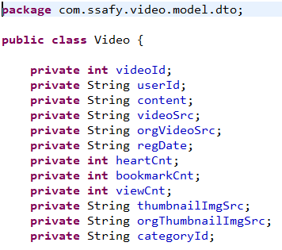 model/dto/Video.java | 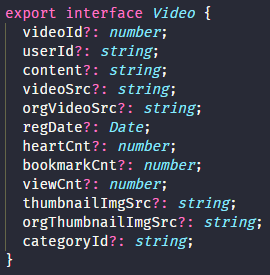 stores/video.ts |

```ts
/**
 * 예시 - 컴포넌트의 prop type 정의
 * component/VideoCard.vue
 */
<script setup lang="ts">
const props = defineProps<{ video: Video }>();
</script>
```

|                                        Java Controller                                        |                           Typescript                           |
| :-------------------------------------------------------------------------------------------: | :------------------------------------------------------------: |
| 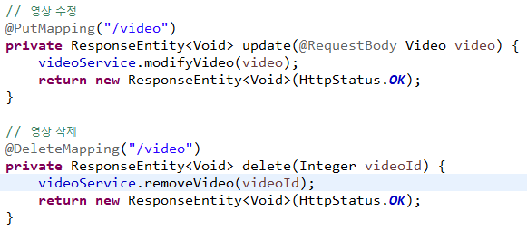 model/controller/VideoController.java | 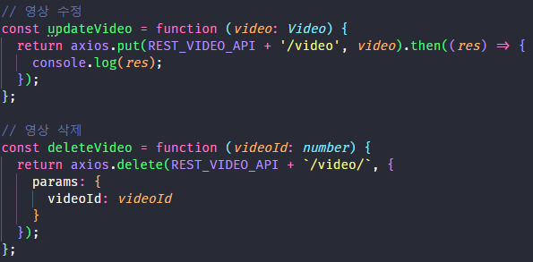 stores/video.ts |

🔍 Spring의 `Controller가 받는 인자`와 `클라이언트의 요청에 담길 내용`을 **타입 정의**를 통해 일치시켰습니다!

<br>

## 5.2. Store의 비동기 통신 Action을 Promise화

컴포넌트에서 Store의 비동기 통신 Action을 사용할 때, axios 통신이 다 끝난 후에 컴포넌트 단의 로직이 순차적으로 실행되길 바랐습니다.

### ▶︎ 해결

Store의 비동기 통신 Action 함수가 promise 객체를 반환하도록 설계하였습니다.

```js
// login.ts

function login(id: string, pw: string) {
    return axios
      .post(`${REST_USER_API}/login`, {
        // ...
```

덕분에 컴포넌트 단에서 비동기 호출 이후 원하는 동작을 수행할 수 있었습니다.

```jsx
// LoginForm.vue

const handleLoginButton = async () => {
  await userStore.login(id.value, password.value);
  router.push({ name: "home" });
};
```

<br>

## 6. 폴더 구조

|                    Backend                     |                     Frontend                     |
| :--------------------------------------------: | :----------------------------------------------: |
| 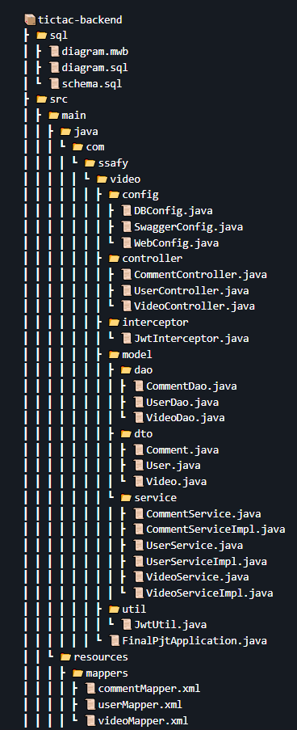 | 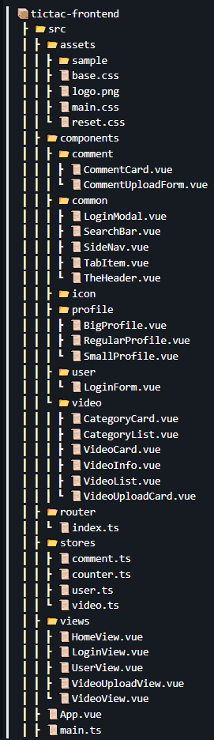 |

## 7. TicTac 세부 명세

- 홈 페이지: 카테고리별 영상 목록 제공


- 로그인 페이지

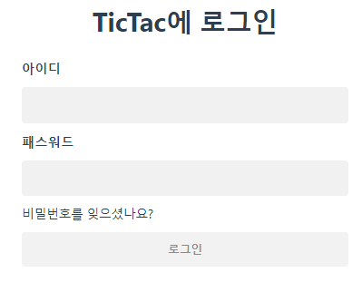

- 업로드 페이지 (영상 드래그 앤 드롭 전)

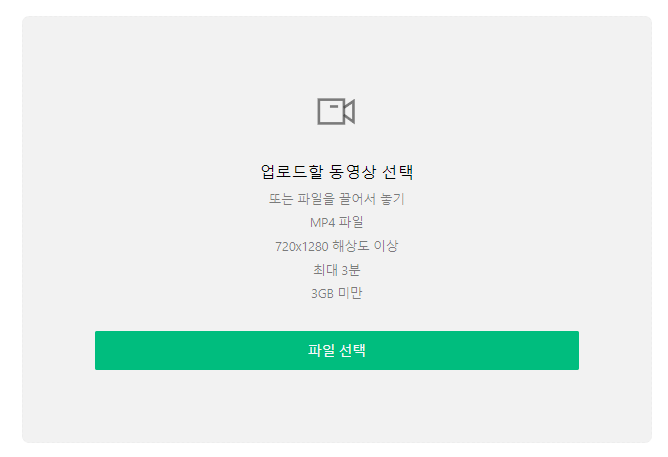

- 업로드 페이지 (영상 드래그 앤 드롭 후): 썸네일 선택 가능

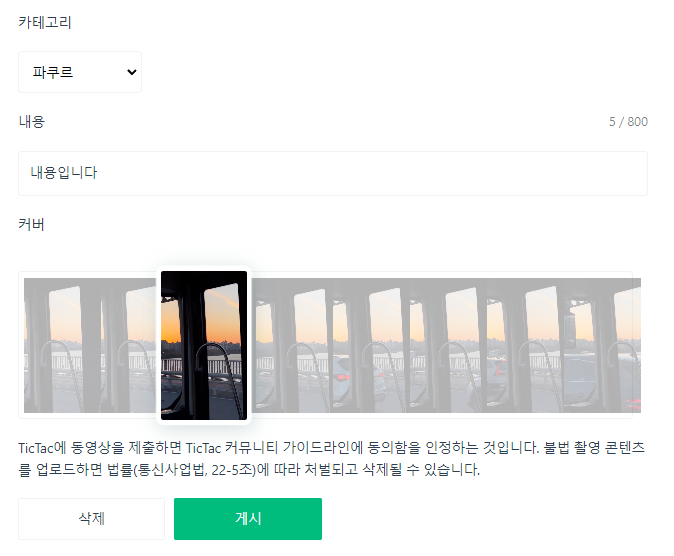

- 유저 페이지: 업로드 영상 목록, 즐겨찾기 한 영상 목록 제공

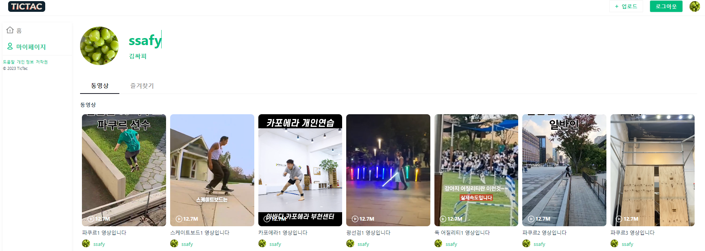

- 영상 상세 페이지: 영상 스트리밍, 댓글 기능 제공


🔍 **자연스러운 영상 배경**을 위해 썸네일을 블러처리한 후 백그라운드에 삽입했습니다.

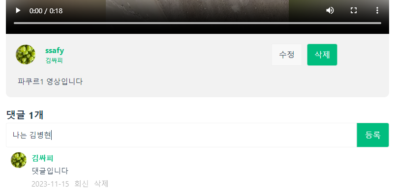

<br>

## 7. TicTac 컨벤션 및 협업 방식

- 하루 2번 notion에서 morning scrum, wrapup scrum을 진행했습니다.

- `eslint`, `prettier` 등을 활용해 코드 스타일을 통일시켰습니다.

- 각자의 브랜치를 만들어서 github으로 협업했습니다.

<br>
